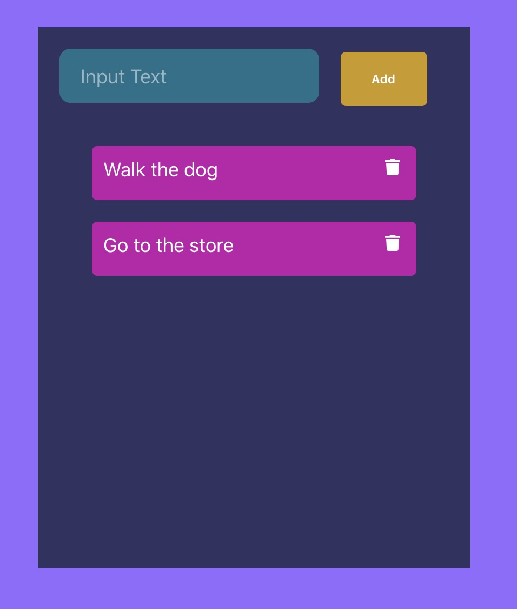

Created a Todo app in React in order to keep practicing my React skills. Also used FontAwesome for the icons and installed react-flip-move for the automation of the items in the list. In this application, I've used React components, React forms, event handlers etc.

This to do app allows you to:
1. Add elements to a list
2. Edit elements in the list
3. Delete elements in the list

I followed this video on YouTube:

https://www.youtube.com/watch?v=N8kYlimhuLw

